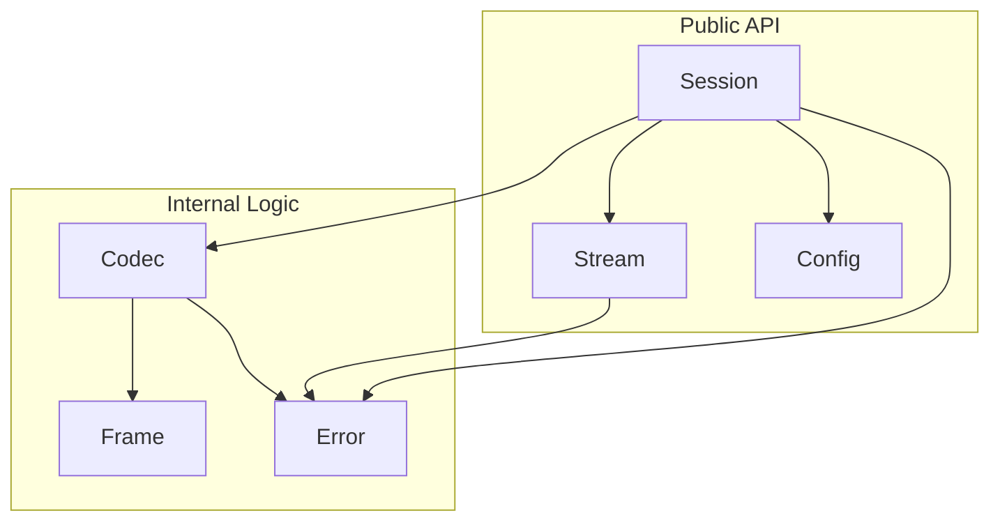
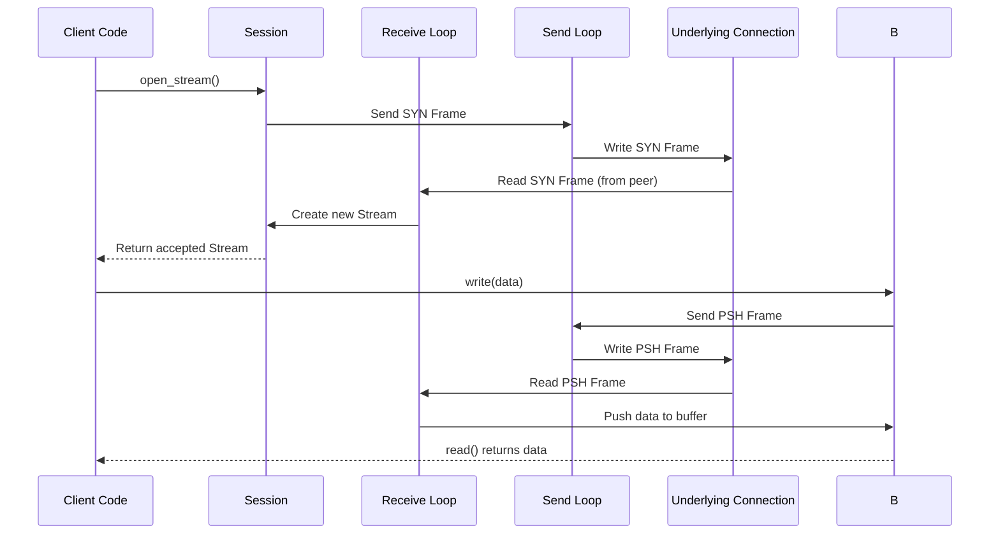

# Smux Rust Library Architecture

## 1. Overview

This document outlines the architecture for a Rust implementation of the `smux` protocol. The design is based on the original Go implementation and aims to provide a high-performance, safe, and ergonomic library for stream multiplexing.

The library will be built on top of `tokio` for asynchronous I/O and will provide a `Session` and `Stream` abstraction, similar to the Go version.

## 2. Core Concepts

*   **Frame**: The fundamental unit of communication in `smux`. A frame consists of a header and a data payload.
*   **Session**: Manages a single underlying connection (e.g., a TCP socket) and multiplexes multiple logical streams over it. It is responsible for creating, accepting, and managing streams.
*   **Stream**: A single, logical, bidirectional communication channel over a `Session`. It provides an interface compatible with `tokio::io::AsyncRead` and `tokio::io::AsyncWrite`.
*   **Codec**: Handles the encoding and decoding of frames from the underlying I/O source.

## 3. Module Structure

The library will be organized into the following modules:

*   `smux::config`: Defines the `Config` struct for session tuning.
*   `smux::frame`: Contains the `Frame` struct and related types for representing `smux` frames.
*   `smux::codec`: Provides the `Codec` for encoding and decoding frames.
*   `smux::session`: The core module, containing the `Session` struct and its management logic.
*   `smux::stream`: Implements the `Stream` struct.
*   `smux::error`: Defines the library's error types.



## 4. Key Data Structures and Traits

### `Config`

A struct for configuring `Session` behavior.

```rust
// In smux::config
pub struct Config {
    pub version: u8,
    pub keep_alive_interval: Duration,
    pub keep_alive_timeout: Duration,
    pub max_frame_size: usize,
    pub max_receive_buffer: usize,
    pub max_stream_buffer: usize,
}
```

### `Frame`

Represents a `smux` frame.

```rust
// In smux::frame
pub struct Frame {
    pub version: u8,
    pub cmd: Command,
    pub stream_id: u32,
    pub data: Bytes,
}

pub enum Command {
    Syn,
    Fin,
    Psh,
    Nop,
    Upd { consumed: u32, window: u32 },
}
```

### `Codec`

A struct that implements `tokio_util::codec::{Encoder, Decoder}` for `Frame` objects.

```rust
// In smux::codec
pub struct Codec;

impl Decoder for Codec {
    type Item = Frame;
    type Error = SmuxError;

    fn decode(&mut self, src: &mut BytesMut) -> Result<Option<Self::Item>, Self::Error> {
        // Implementation for decoding a frame from bytes
    }
}

impl Encoder<Frame> for Codec {
    type Error = SmuxError;

    fn encode(&mut self, item: Frame, dst: &mut BytesMut) -> Result<(), Self::Error> {
        // Implementation for encoding a frame to bytes
    }
}
```

### `Session`

The main session object. It will manage all streams and the underlying connection.

```rust
// In smux::session
pub struct Session<T> {
    // The underlying connection, wrapped in a framed codec
    framed: Framed<T, Codec>,
    // All active streams
    streams: Arc<Mutex<HashMap<u32, Arc<Stream>>>>,
    // Configuration
    config: Arc<Config>,
    // Channel for accepting new streams
    accept_ch: mpsc::Receiver<Stream>,
    // ... other internal state
}

impl<T: AsyncRead + AsyncWrite + Unpin> Session<T> {
    pub fn new(conn: T, config: Config, is_client: bool) -> Self { ... }
    pub async fn open_stream(&self) -> Result<Stream, SmuxError> { ... }
    pub async fn accept_stream(&mut self) -> Result<Stream, SmuxError> { ... }
    pub async fn close(&self) -> Result<(), SmuxError> { ... }
}
```

### `Stream`

Represents a single logical stream.

```rust
// In smux::stream
pub struct Stream {
    id: u32,
    session: Weak<SessionInner>, // Use Weak to avoid cycles
    read_buffer: Mutex<VecDeque<Bytes>>,
    read_notifier: Notify,
    // ... other state like window size, etc.
}

impl AsyncRead for Stream { ... }
impl AsyncWrite for Stream { ... }
```

## 5. Concurrency Model

The `Session` will spawn two main `tokio` tasks:

1.  **Receive Loop**: Continuously reads frames from the underlying connection using the `Codec`. It dispatches frames to the appropriate `Stream` or handles session-level commands (e.g., `SYN` for new streams).
2.  **Send Loop**: A `mpsc` channel will be used to send frames from all streams to this loop, which then writes them to the connection. This serializes writes and simplifies concurrency control.



## 6. Flow Control

*   **Session-level**: A token bucket mechanism will control the total number of bytes that can be buffered across all streams, preventing the session from being overwhelmed.
*   **Stream-level (v2)**: A sliding window protocol will be implemented for each stream. The `Stream` will send `UPD` frames to the peer to signal how much data it has consumed, updating the send window.

## 7. API Design

The public API will be simple and intuitive.

```rust
use smux::{Config, Session};
use tokio::net::TcpStream;

#[tokio::main]
async fn main() {
    // Client side
    let stream = TcpStream::connect("127.0.0.1:8080").await.unwrap();
    let session = Session::new(stream, Config::default(), true);

    let mut stream1 = session.open_stream().await.unwrap();
    stream1.write_all(b"hello").await.unwrap();

    // Server side
    let listener = TcpListener::bind("127.0.0.1:8080").await.unwrap();
    let (stream, _) = listener.accept().await.unwrap();
    let mut session = Session::new(stream, Config::default(), false);

    loop {
        match session.accept_stream().await {
            Ok(mut stream) => {
                tokio::spawn(async move {
                    let mut buf = [0; 1024];
                    let n = stream.read(&mut buf).await.unwrap();
                    println!("Received: {}", String::from_utf8_lossy(&buf[..n]));
                });
            }
            Err(SmuxError::SessionClosed) => {
                // Session closed gracefully
                break;
            }
            Err(e) => {
                // Handle other errors
                eprintln!("Failed to accept stream: {}", e);
                break;
            }
        }
    }
}
```

## 8. Error Handling

A single `SmuxError` enum will be used throughout the library, implemented with `thiserror`.

```rust
// In smux::error
#[derive(Debug, thiserror::Error)]
pub enum SmuxError {
    #[error("I/O error: {0}")]
    Io(#[from] std::io::Error),

    #[error("Invalid protocol version")]
    InvalidProtocol,

    #[error("Frame too large")]
    FrameTooLarge,

    #[error("Session closed")]
    SessionClosed,

    // ... other error variants
}
```

This architecture provides a solid foundation for building a high-quality `smux` library in Rust. It balances the need for performance and safety with the goal of providing a clean, maintainable, and easy-to-use API.
