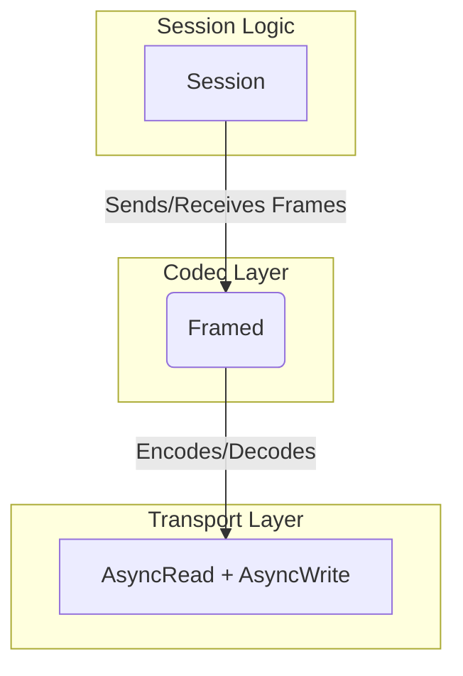

# 004: Codec Specification

This document specifies the `Codec`, which is responsible for encoding `Frame` objects into a byte stream and decoding a byte stream back into `Frame` objects. The `Codec` will be implemented using the `tokio_util::codec` traits.

## 1. Overview

The `Codec` acts as the bridge between the raw, stream-based I/O of the underlying transport (e.g., TCP) and the message-oriented `smux` protocol. It allows the `Session` to work with `Frame` objects directly, abstracting away the details of byte-level parsing.



## 2. `Codec` Struct

The `Codec` itself will be a zero-sized struct, as it holds no state between calls.

```rust
pub struct Codec;
```

## 3. `Decoder` Implementation

The `Decoder` implementation is responsible for parsing `Frame` objects from an incoming byte stream (`BytesMut`).

```rust
use tokio_util::codec::Decoder;
use bytes::BytesMut;

const HEADER_SIZE: usize = 8; // ver(1) + cmd(1) + len(2) + sid(4)

impl Decoder for Codec {
    type Item = Frame;
    type Error = SmuxError;

    fn decode(&mut self, src: &mut BytesMut) -> Result<Option<Self::Item>, Self::Error> {
        // 1. Check if we have enough data to read the header.
        if src.len() < HEADER_SIZE {
            // Not enough data, ask for more.
            return Ok(None);
        }

        // 2. Parse the header without consuming the bytes yet.
        let header = &src[..HEADER_SIZE];
        let version = header[0];
        let cmd_byte = header[1];
        let length = u16::from_le_bytes([header[2], header[3]]) as usize;
        let stream_id = u32::from_le_bytes([header[4], header[5], header[6], header[7]]);

        // 3. Check if we have the full frame data.
        if src.len() < HEADER_SIZE + length {
            // The full frame has not arrived yet.
            // Reserve more space in the buffer if needed.
            src.reserve(HEADER_SIZE + length - src.len());
            return Ok(None);
        }

        // 4. We have the full frame, so consume the header.
        src.advance(HEADER_SIZE);

        // 5. Consume and extract the data payload.
        let data = if length > 0 {
            src.split_to(length).freeze()
        } else {
            Bytes::new()
        };

        // 6. Parse the command and construct the Frame.
        let cmd = Command::from_byte(cmd_byte, &data)?;
        let frame = Frame {
            version,
            cmd,
            stream_id,
            data,
        };

        Ok(Some(frame))
    }
}
```

## 4. `Encoder` Implementation

The `Encoder` implementation is responsible for writing a `Frame` object to a byte buffer (`BytesMut`).

```rust
use tokio_util::codec::Encoder;
use bytes::BytesMut;

impl Encoder<Frame> for Codec {
    type Error = SmuxError;

    fn encode(&mut self, item: Frame, dst: &mut BytesMut) -> Result<(), Self::Error> {
        let data_len = item.data.len();
        if data_len > u16::MAX as usize {
            return Err(SmuxError::FrameTooLarge);
        }

        // Reserve space for the header and data.
        dst.reserve(HEADER_SIZE + data_len);

        // Write header fields.
        dst.put_u8(item.version);
        dst.put_u8(item.cmd.to_byte());
        dst.put_u16_le(data_len as u16);
        dst.put_u32_le(item.stream_id);

        // Write data payload.
        dst.put(item.data);

        Ok(())
    }
}
```

## 5. Usage with `Framed`

The `Session` will use `tokio_util::codec::Framed` to wrap the underlying transport with the `Codec`.

```rust
use tokio_util::codec::Framed;
use tokio::net::TcpStream;

let stream = TcpStream::connect("...").await?;
let mut framed = Framed::new(stream, Codec);

// Now we can send and receive `Frame` objects.
let frame = Frame { ... };
framed.send(frame).await?;

if let Some(Ok(received_frame)) = framed.next().await {
    // Process the received frame
}
