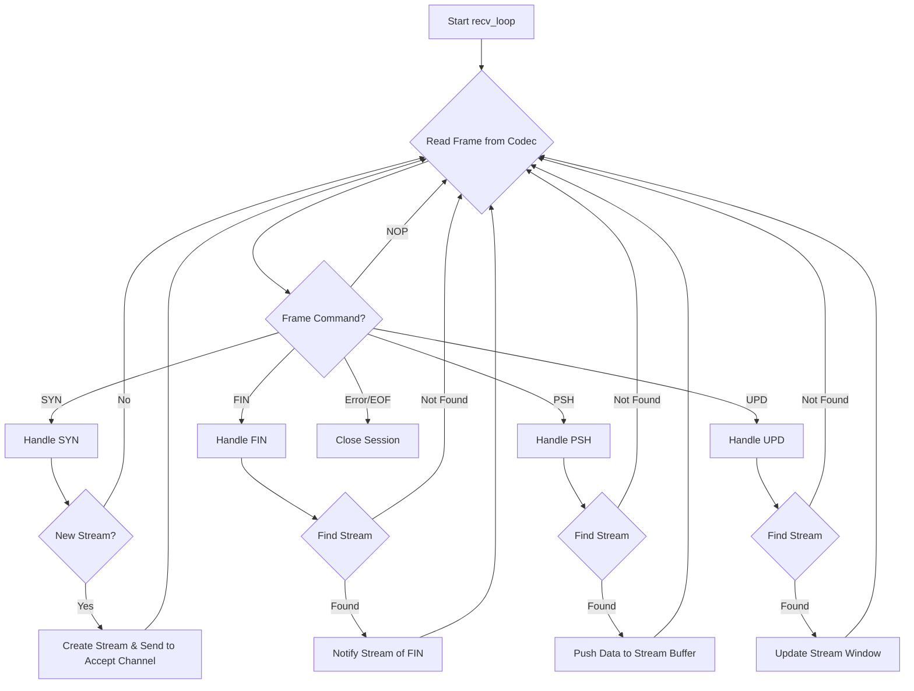

# 005: Session Specification

This document details the internal design of the `Session`, which is the central component for managing a `smux` connection.

## 1. Overview

The `Session` is responsible for:
*   Managing the lifecycle of the underlying transport (e.g., a TCP connection).
*   Multiplexing multiple `Stream`s over this single connection.
*   Handling frame encoding/decoding via the `Codec`.
*   Enforcing session-level flow control.
*   Spawning and managing tasks for asynchronous operations.

## 2. `Session` Structure

The `Session` will be split into a public-facing `Session` handle and an internal `SessionInner` struct to manage the shared state.

```rust
// Public handle
pub struct Session<T> {
    inner: Arc<SessionInner<T>>,
}

// Internal state, shared among tasks
struct SessionInner<T> {
    // Framed transport for I/O
    framed: Mutex<Framed<T, Codec>>,
    // All active streams
    streams: Mutex<HashMap<u32, Arc<Stream>>>,
    // Configuration
    config: Arc<Config>,
    // Channel for accepting new streams
    accept_tx: mpsc::Sender<Stream>,
    // Next stream ID to use
    next_stream_id: AtomicU32,
    // Session close signal
    die: Notify,
    // ... other state like token bucket for flow control
}
```

This `Arc<Mutex<...>>` pattern allows safe, shared access to the session's state from multiple concurrent tasks.

## 3. Concurrency Model

The `Session`'s work is primarily done in two background tasks, which are spawned when a new `Session` is created.

### 3.1. Receive Loop (`recv_loop`)

This task owns the read half of the `Framed` transport. Its sole responsibility is to read incoming frames and dispatch them.



### 3.2. Send Loop (`send_loop`)

To avoid contention on the write half of the transport, all outgoing frames are sent through a `mpsc` channel to a dedicated `send_loop` task. This task owns the write half of the `Framed` transport.

*   **Input**: `mpsc::Receiver<Frame>`
*   **Action**: Reads `Frame` from the channel and writes it to the `Framed` transport.
*   **Benefit**: Serializes all writes to the underlying connection, simplifying locking and preventing interleaved writes from different streams.

## 4. Stream Lifecycle

*   **Opening a Stream (`open_stream`)**:
    1.  A new, unique stream ID is generated.
    2.  A `SYN` frame is created with this ID.
    3.  The frame is sent to the `send_loop`.
    4.  A new `Stream` object is created and stored in the `streams` map.
    5.  The `Stream` is returned to the caller.

*   **Accepting a Stream (`accept_stream`)**:
    1.  The `recv_loop` receives a `SYN` frame.
    2.  It creates a new `Stream` object.
    3.  The `Stream` is sent to the `accept_ch` channel.
    4.  The public `accept_stream` method simply waits on this channel.

*   **Closing a Stream**:
    1.  When a `Stream` is closed (or dropped), it sends a `FIN` frame.
    2.  The `Session` removes the stream from its `streams` map.
    3.  When the peer receives the `FIN`, it also closes its end of the stream.

## 5. Flow Control

A session-wide token bucket will be used for flow control.

*   The bucket is initialized with `config.max_receive_buffer` tokens.
*   When the `recv_loop` reads a `PSH` frame, it consumes tokens equal to the frame's data length.
*   If the bucket is empty, the `recv_loop` will pause, effectively applying backpressure to the remote sender.
*   When a `Stream`'s read buffer is consumed by the user, it returns the corresponding number of tokens to the session's bucket.

This mechanism prevents a single fast-sending peer from overwhelming the receiver's memory.

## 6. Keep-Alive

If enabled in the `Config`, a separate task will periodically send `NOP` frames to the peer. If no frames (of any kind) are received from the peer within `config.keep_alive_timeout`, the session will be closed. This ensures that dead connections are detected and cleaned up.
