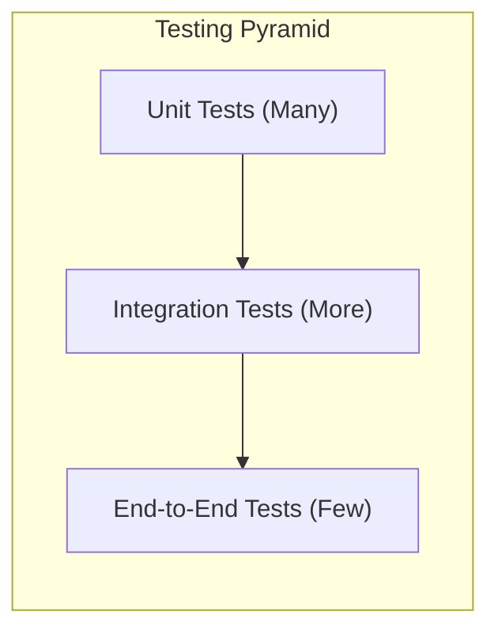

# 008: Test Strategy

This document outlines the testing strategy for the `smux` library to ensure its correctness, robustness, and reliability.

## 1. Testing Pyramid

Our strategy will follow the principles of the testing pyramid, with a broad base of fast unit tests, a smaller set of integration tests, and a few comprehensive end-to-end tests.

## 2. Unit Tests

*   **Goal**: To test individual components (functions, structs, modules) in isolation. These tests should be fast and cover as much of the internal logic as possible.
*   **Location**: Inside the module they are testing, within a `#[cfg(test)] mod tests { ... }` block.
*   **Tooling**:
    *   **`mockall`**: For mocking dependencies (e.g., mocking a `Session` when testing a `Stream`).
*   **Examples**:
    *   Testing the `Codec`'s ability to encode and decode all frame types correctly.
    *   Testing the `Frame` command parsing logic.
    *   Testing state transitions within the `Stream` (e.g., from open to closed).

## 3. Integration Tests

*   **Goal**: To test how different components of the library work together. These tests will involve multiple modules interacting.
*   **Location**: In the `tests/` directory at the root of the crate.
*   **Methodology**:
    *   Tests will create a `Session` with a real (but mocked) transport layer, like `tokio::io::duplex`. This allows testing the full `Session` and `Stream` interaction without actual networking.
    *   We will test scenarios involving multiple streams, session-level flow control, and keep-alive messages.
*   **Examples**:
    *   Verify that data written to a `Stream` on the client `Session` can be read from the corresponding `Stream` on the server `Session`.
    *   Test that opening and closing many streams concurrently does not corrupt the session state.
    *   Verify that the session-level flow control correctly applies backpressure.

## 4. End-to-End (E2E) Tests

*   **Goal**: To test the library in a production-like scenario, using a real network transport.
*   **Location**: Also in the `tests/` directory, possibly in a separate file like `tests/e2e.rs`.
*   **Methodology**:
    *   These tests will spin up a real `tokio::net::TcpListener` and `TcpStream`.
    *   They will verify the library's behavior over a real network loopback, including handling of potential network delays or interruptions (if possible to simulate).
*   **Examples**:
    *   A full client-server interaction: server accepts a connection, client opens a stream, they exchange data, and then close the stream and session cleanly.
    *   Test the keep-alive mechanism by having an idle connection and ensuring it's properly maintained or timed out.
    *   **Interop Testing**: A key E2E test will involve a Rust client communicating with a Go server (from the original implementation), and a Go client communicating with a Rust server. This will validate protocol compliance.

## 5. Property-Based Testing

*   **Goal**: To uncover edge cases and bugs that are hard to find with example-based testing.
*   **Tooling**:
    *   **`proptest`**: To generate a wide range of random inputs and assert that certain properties of the system hold true.
*   **Examples**:
    *   **Frame Roundtrip**: A property test to ensure that any `Frame` object, when encoded and then decoded, results in the original `Frame`.
    *   **Data Integrity**: A property test to ensure that any arbitrary `Vec<u8>` written to a stream is received identically on the other side.

## 6. CI (Continuous Integration)

All tests (unit, integration, E2E) will be run automatically on every push and pull request using a CI service like GitHub Actions. This ensures that no changes break existing functionality. The `cargo test --all` command will be used to run all tests.

## 7. Concurrency Testing

*   **Goal**: To specifically target and validate the thread-safety and concurrent behavior of the library.
*   **Tooling**:
    *   **`loom`**: For exhaustive concurrency testing to detect subtle race conditions and deadlocks.
    *   **`tokio::test` macro**: For running multi-threaded async tests.
*   **Methodology**:
    *   We will create dedicated tests that spawn many `tokio` tasks to interact with a single `Session` and its `Stream`s concurrently.
*   **Examples**:
    *   A `loom` test to verify the atomicity of the `Session`'s internal state changes (e.g., `next_stream_id`, `streams` map).
    *   A multi-threaded test where many tasks simultaneously open, write to, and close streams on the same session to ensure no data corruption or panics occur.
