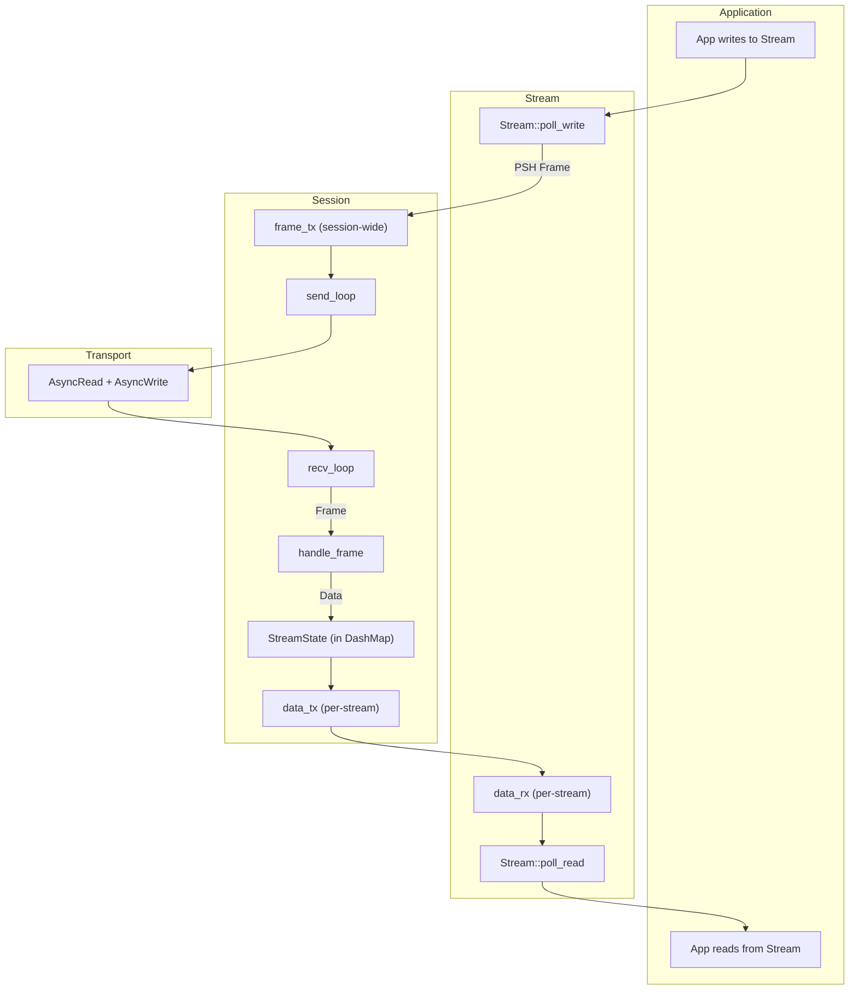
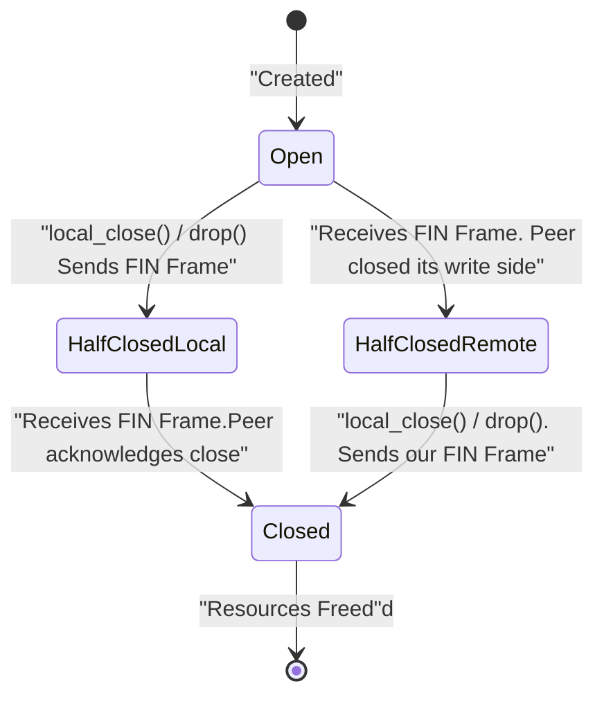
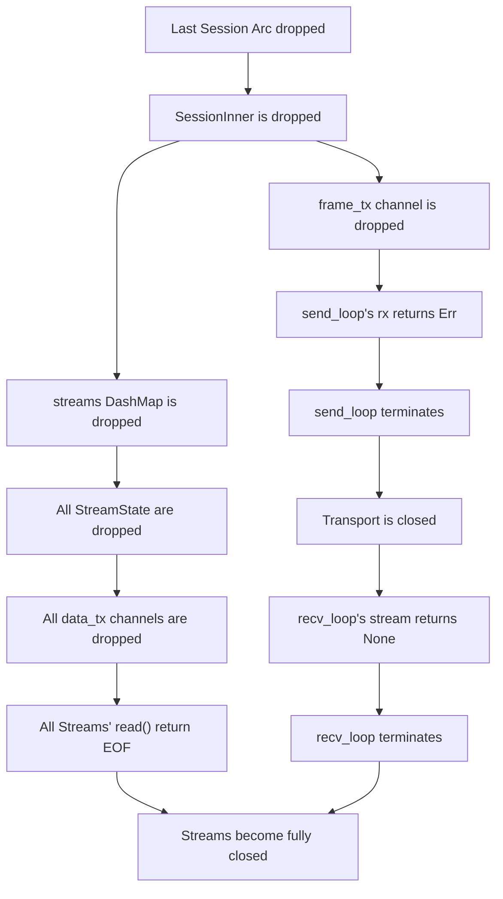

# Smux Session and Stream State Management Analysis

This document provides an in-depth analysis of the core control flow, state management, and lifecycle of `Session` and `Stream` in the `smux` library.

## 1. Core Architecture and Control Flow

The core of `smux` is a multiplexing model where a single `Session` manages multiple `Stream`s. The `Session` handles all underlying network I/O through two independent background tasks (`send_loop` and `recv_loop`), decoupling the `Stream` logic from network details.

-   **Data Sending**: `Stream::write` -> `PSH Frame` -> `frame_tx` channel -> `send_loop` -> `Transport`
-   **Data Receiving**: `Transport` -> `recv_loop` -> `PSH Frame` -> `handle_psh_frame` -> `data_tx` channel -> `Stream::read`

The overall system architecture is shown below:

## 2. Stream Close Process and Half-Close Mechanism

A `Stream` is closed using a `FIN` frame and internal state flags (`is_read_closed` / `is_write_closed`), supporting independent read/write half-closures.

-   **Write Close (Local Close)**: When the application calls `stream.close()` or drops the `Stream`, a `FIN` frame is sent to the peer, and `is_write_closed` is set to `true`. The stream can no longer be written to.
-   **Read Close (Remote Close)**: When the `Session` receives a `FIN` frame, it closes the internal data channel (`data_tx`) to the corresponding `Stream`. This causes the `Stream`'s `read` operation to return `EOF` (0 bytes) and sets `is_read_closed` to `true`.

The complete lifecycle of a `Stream` can be represented by the following state machine:

## 3. Session Drop and Cascading Close

When a `Session` is dropped, it triggers a cascading close of all active `Stream`s through Rust's RAII principle. This process is automatic and safe.

When the last `Session` handle is dropped, the reference count of `Arc<SessionInner>` becomes zero, and `SessionInner` is destroyed, triggering the following chain reaction:

### Summary

1.  **Control Flow**: The `send_loop` and `recv_loop` in `Session` are central. They are decoupled from `Stream`s via `flume` channels, enabling efficient multiplexing.
2.  **Stream Closure**: An elegant half-close and full-close mechanism is implemented using `FIN` frames and internal state flags, managed by a clear state machine.
3.  **Session Closure**: The `Session`'s drop behavior leverages the RAII mechanism to safely terminate background tasks by closing internal channels and cascades the closure to all associated `Stream`s, ensuring complete resource release.

This design fully utilizes Rust's concurrency primitives and ownership system to build a robust, lock-free, and efficient multiplexing library.